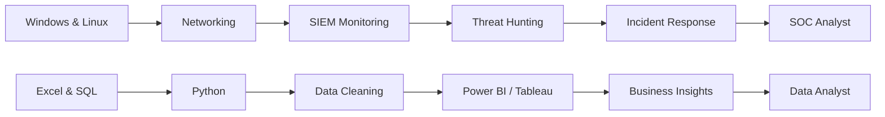

<div align="center">


<br/>


</div>

---

## 👨‍💻 About Me


```yaml
name: Vivek Kandpal
role:
  - SOC Analyst
  - Data Analyst
location: India
education: Bachelor of Computer Applications
focus:
  - Threat Detection
  - Incident Investigation
  - Security Monitoring
  - Data Cleaning
  - Dashboard Development
currently_learning:
  - Microsoft Sentinel
  - Splunk
  - Python Automation
  - SQL
  - Power BI
goal: Build secure systems and turn raw data into useful insights
```

- 🔐 Building practical **SOC and Blue Team projects**
- 📊 Creating **SQL, Python, Excel, Tableau and Power BI projects**
- 🛡️ Practising threat hunting with **Splunk, Sysmon and Windows Event Logs**
- 🚀 Publishing projects, reports, dashboards and detection rules on GitHub
- 💬 Ask me about **SOC, SIEM, SQL, Power BI, Python and cybersecurity labs**

<br clear="both"/>

---

## 🛡️ Cybersecurity & SOC Skills

<div align="center">


<br/><br/>


</div>

---

## 📊 Data Analytics Skills

<div align="center">


<br/><br/>


</div>

---

## 🚀 Featured SOC Projects

| Project | Tools | Description |
|---|---|---|
| [Threat Hunting SOC Lab](https://github.com/Vivek11commits/Threat-Hunting-SOC-Lab) | Splunk, Sysmon, Windows Logs | Real-log threat hunting, detections, MITRE mapping and investigations |
| [Microsoft Sentinel Detection Lab](https://github.com/Vivek11commits/Microsoft-Sentinel-Detection-Lab) | Sentinel, KQL, Analytics Rules | Cloud SIEM detections, workbooks and incident investigation |
| [SOAR Lite Automation](https://github.com/Vivek11commits/SOAR-Lite-Automation) | Python, EVTX, IOC Analysis | Automated log parsing, IOC extraction, severity scoring and reporting |
| [Port Scanning Investigation](https://github.com/Vivek11commits/Port-Scanning-Investigation) | Nmap, Splunk, Firewall Logs | Detection and investigation of suspicious network scanning |
| [Phishing Email Detection](https://github.com/Vivek11commits/Phishing-Email-Detection) | Splunk, CSV, SPL | Detection of suspicious senders, links and attachment activity |
| [Ransomware Detection](https://github.com/Vivek11commits/Ransomware-Detection) | Splunk, Sysmon | Behaviour-based ransomware monitoring and investigation |
| [PowerShell Attack Detection](https://github.com/Vivek11commits/PowerShell-Attack-Detection) | PowerShell, Splunk | Detects encoded commands and suspicious PowerShell execution |
| [Brute Force Detection](https://github.com/Vivek11commits/Brute-Force-Detection) | Splunk, Windows Security | Failed login analysis and brute-force alert logic |

---

## 📈 Featured Data Analyst Projects

| Project | Tools | Description |
|---|---|---|
| [Netflix Data Analysis](https://github.com/Vivek11commits/Netflix-Data-Analysis) | MySQL, Power BI | Content trends, ratings, countries, genres and release-year analysis |
| [Blinkit Sales Dashboard](https://github.com/Vivek11commits/Blinkit-Sales-Analytics) | MySQL, Power BI | Sales KPIs, outlet performance and product-category insights |
| [COVID-19 Dashboard](https://github.com/Vivek11commits/COVID-19-Dashboard) | SQL, Power BI | Cases, deaths, recovery trends and country-level comparisons |
| [Equality Score Analysis](https://github.com/Vivek11commits/Equality-Score-Analysis) | Excel, Tableau | Equality classification and workforce fairness visualization |
| [SQL Practice Solutions](https://github.com/Vivek11commits/SQL-Practice) | MySQL, SQL | LeetCode, HackerRank and interview-focused SQL solutions |

---

## 📊 GitHub Analytics

<div align="center">


<br/>


</div>

> GitHub language cards show repository language usage, not your overall skill level.

---

## 📉 Contribution Activity Graph

<div align="center">

[](https://github.com/Vivek11commits)

</div>

---

## 🏆 GitHub Trophies

<div align="center">


</div>

---

## 🐍 Contribution Snake

<div align="center">

<picture>
  <source media="(prefers-color-scheme: dark)" srcset="https://raw.githubusercontent.com/Vivek11commits/Vivek11commits/output/github-contribution-grid-snake-dark.svg">
  <source media="(prefers-color-scheme: light)" srcset="https://raw.githubusercontent.com/Vivek11commits/Vivek11commits/output/github-contribution-grid-snake.svg">
  
</picture>

</div>

---

## 🎯 Current Learning Roadmap



---

## 📌 What I Bring

```text
Security Monitoring       █████████████████░░░  85%
Splunk & SPL              ████████████████░░░░  80%
Windows Event Analysis    ████████████████░░░░  80%
SQL                       ███████████████░░░░░  75%
Power BI                  ██████████████░░░░░░  70%
Python                    ████████████░░░░░░░  65%
```

---

## 🤝 Connect With Me

<div align="center">

<a href="https://github.com/Vivek11commits">
  
</a>
<a href="(https://www.linkedin.com/in/vivekkandpal/)">
  
</a>
<a href="kandpalv54@gmail.com">
  
</a>

<br/><br/>

### 💡 “Detect threats. Analyze data. Create impact.”


</div>
